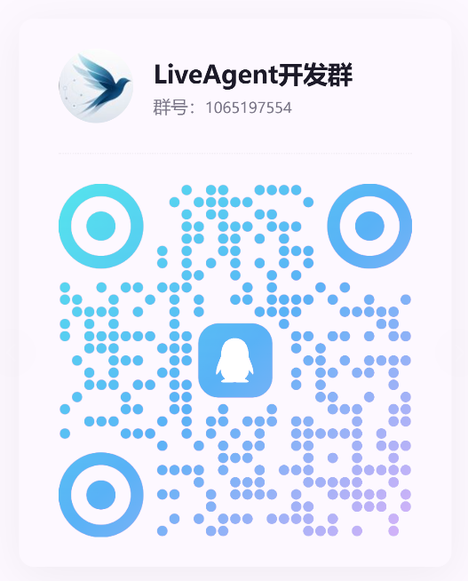

<p align="center">
  
</p>

<h1 align="center">LiveAgent</h1>

<p align="center">
  <strong>Your Self-Hosted AI Agent Workspace</strong><br/>
  多模型接入 · 真实工具执行 · MCP & Skills 生态 · 浏览器与桌面端共用一个后端
</p>

<p align="center">
  <a href="README.md">English</a> | 简体中文
</p>

<p align="center">
  
  
  
  
  
  
</p>

<p align="center">
  <a href="#核心能力">核心能力</a> •
  <a href="#下载与部署">下载与部署</a> •
  <a href="#faq">FAQ</a> •
  <a href="docs/">文档</a>
</p>

---

## 🌟 特别鸣谢

<p align="center">
  <a href="https://linux.do">
    
  </a>
</p>
<p align="center"><b>学AI，上L站！祝小破站越来越好～</b></p>

---

## ❤️ 赞助商

<table>
<tr>
<td width="200" align="center" valign="middle"><a href="https://www.packyapi.com/register"></a></td>
<td valign="middle">PackyCode 是一家稳定、高效、专业的API中转服务商，提供 Claude Code、Codex、Gemini，国模 等多种中转服务，老牌顶级中转，<b>开发本软件用的绝大多数模型资源都是PackyCode提供，感谢老农！</b>从 <a href="https://www.packyapi.com/register">此处</a> 注册并开始使用！ </td>
</tr>
<tr>
<td width="200" align="center" valign="middle"><a href="https://www.right.codes/register"></a></td>
<td valign="middle">Right Code 提供稳定的 Claude Code、Codex、Gemini，国模 等模型的中转服务。充值即可开票，企业、团队用户一对一对接。<b>开发本软件用的另一部分模型资源都是RightCode提供，感谢RC站长，感谢小客服！</b> 从 <a href="https://www.right.codes/register">此处</a> 注册并开始使用！</td>
</tr>
<tr>
<td width="200" align="center" valign="middle"><a href="https://cubence.com/signup"></a></td>
<td valign="middle">Cubence 是一家可靠高效的 API 中转服务商，提供 Claude Code、Codex、Gemini 等多种模型的中转服务，支持按量付费的计费方式。<b>感谢 Cubence 对本项目的支持！</b>从 <a href="https://cubence.com/signup">此处</a> 注册并开始使用！</td>
</tr>
</table>


---

## 🤝 一起来开发吧！

<p align="center">
  
</p>

<p align="center">
  欢迎扫码进群，一起推进 LiveAgent 的开发！<br/>
  （至于为什么是QQ群，感觉功能比微信群多一些～）
</p>


---

## 为什么是 LiveAgent?

LiveAgent 是一个 **自部署** 的 AI Agent。它将大语言模型的推理能力与真实系统工具深度整合,让 AI 能够真正操作你的文件系统、执行命令、管理定时任务;桌面端和浏览器连的是同一个后端。

- **真正动手的 Agent** — 不止于对话:读写文件、精确编辑、执行 Bash、托管长驻进程
- **生态完全开放** — MCP 协议桥接任意外部工具,Skills 技能包按需加载
- **密钥只在后端** — 只有后端持有凭据,而后端跑在哪里由你决定:自己的笔记本、家里的服务器,或者你自己的 VPS

---

## 核心能力


### 🧠 多模型与对话

- **多模型路由** — Claude(Anthropic)与 Codex(OpenAI)、Gemini 三协议,支持自定义 Base URL 接入第三方兼容服务
- **富文本渲染** — Markdown 流式渲染,内建 KaTeX 公式、Mermaid 图表与 Monaco 代码预览
- **历史压缩** — Segment + Summary Checkpoint 双层持久化,长对话不丢上下文
- **国际化** — 内建 i18n 多语言框架

### 🔧 本地工具执行

- **文件系统全能力** — `Read` / `Write` / `Edit` / `Delete` 精确读写,`Glob` / `Grep` 模式与正则搜索
- **Bash 与长驻进程** — 非交互式命令执行(cwd / timeout),`ManagedProcess` 托管 dev server 等常驻任务
- **Sub-Agent 委派** — 独立子代理并行执行,worktree 隔离,自动合并
- **隧道暴露** — `TunnelManager` 一键将本地服务暴露公网

### 🧩 MCP 与 Skills 生态

- **MCP 协议桥接** — 后端原生桥接任意 stdio / http MCP Server,无限扩展工具能力
- **Skills 技能包** — 渐进式披露、按需加载,支持安装 / 创建 / 打包与 ClawHub 生态

### 💾 记忆与自动化

- **持久化记忆** — Markdown + SQLite FTS 全文检索,跨会话知识管理
- **定时任务** — bash / http / prompt 三种 Cron 任务类型,后台自动执行

### 🌐 浏览器与桌面端,同一个后端

- **一份代码,两个壳** — 桌面端和浏览器跑的是同一份前端构建产物,唯一区别是指向哪个后端地址
- **断线可恢复** — 事件 WebSocket 断线重连并补齐,后端持久化兜底

---

## 下载与部署

安装包由 GitHub Actions 自动构建、签名并发布,请前往 [**GitHub Releases**](https://github.com/Stack-Cairn/LiveAgent/releases/latest) 获取最新版本。

### 系统要求

| 平台 | 要求 |
|---|---|
| macOS | Intel(x64)与 Apple Silicon(aarch64)双架构 |
| Windows | x64,需 WebView2 运行时(Windows 11 已内置) |
| Linux | x86_64,需 WebKitGTK 4.1(Ubuntu 22.04+ / Debian 12+ 等) |

### macOS 用户

从 [Releases](https://github.com/Stack-Cairn/LiveAgent/releases/latest) 下载对应芯片的 DMG,打开后将 LiveAgent 拖入「应用程序」:

- Apple Silicon(M 系列):`LiveAgent-<版本>-macOS-aarch64.dmg`
- Intel:`LiveAgent-<版本>-macOS-x64.dmg`

> 安装包已签名并通过 Apple 公证,首次启动无需在安全设置中手动放行。

### Windows 用户

从 [Releases](https://github.com/Stack-Cairn/LiveAgent/releases/latest) 按需选择一种安装方式:

| 方式 | 文件 | 适合 |
|---|---|---|
| 安装向导 | `LiveAgent-<版本>-Windows-x64-Setup.exe` | 大多数用户 |
| MSI 包 | `LiveAgent-<版本>-Windows-x64.msi` | 企业分发 / 静默安装 |
| 便携版 | `LiveAgent-<版本>-Windows-x64-portable.zip` | 免安装,解压即用 |

### Linux 用户

从 [Releases](https://github.com/Stack-Cairn/LiveAgent/releases/latest) 按发行版选择:

| 格式 | 适用发行版 | 安装方式 |
|---|---|---|
| AppImage | 任意发行版 | `chmod +x` 后直接运行 |
| DEB | Debian / Ubuntu 系 | `sudo dpkg -i LiveAgent-<版本>-Linux-x86_64.deb` |
| RPM | Fedora / openSUSE 系 | `sudo rpm -i LiveAgent-<版本>-Linux-x86_64.rpm` |

### 需要远程访问?(旧版 Gateway)

> **⚠️ 计划在 v2.0 停用** —— 下面这套 Gateway 部署方式在 v2.0 会断。
> 已经部署的用户请先读 [v2.0 迁移指南](README.md#v20-迁移指南--v20-migration-guide)。

v2.0 没有 Gateway 这一层:你把 **后端** 部署在想要的位置,桌面端或浏览器直连它。
如果后端在 NAT 后面而你在外面,那是 **网络层的问题,用网络层的办法解决** ——
[Tailscale](https://tailscale.com/)、[frp](https://github.com/fatedier/frp) 或
[Cloudflare Tunnel](https://developers.cloudflare.com/cloudflare-one/connections/connect-networks/),
应用本身不再内置任何会合注册与打洞逻辑。

下面是 v1 的 Gateway 部署方式,保留给已经在用的人。

**注意：在部署并使用Nginx反向代理后，设置中Remote页面Gateway地址填写Https地址，端口号填写443。**

```bash
# 拉取镜像(GitHub Actions 自动构建,multi-arch: amd64 / arm64)
docker pull ghcr.io/stack-cairn/liveagent-gateway:latest

# 后台运行(HTTP/WebSocket → 宿主机 3000)
docker run -d \
  --name liveagent-gateway \
  --restart unless-stopped \
  -p 3000:8080 \
  -v liveagent-gateway-data:/var/lib/liveagent \
  -e LIVEAGENT_GATEWAY_TOKEN=your-token \
  ghcr.io/stack-cairn/liveagent-gateway:latest
```

命名卷用于持久化 Gateway 数据库和独立签发的 Agent Token，重建容器时不会丢失。

**一键升级到最新版** — 拉取新镜像 → 删除旧容器 → 以相同参数重建(若你修改过端口映射或 token,请同步替换下方参数):

```bash
docker pull ghcr.io/stack-cairn/liveagent-gateway:latest \
  && docker rm -f liveagent-gateway \
  && docker run -d \
    --name liveagent-gateway \
    --restart unless-stopped \
    -p 3000:8080 \
    -v liveagent-gateway-data:/var/lib/liveagent \
    -e LIVEAGENT_GATEWAY_TOKEN=your-token \
    ghcr.io/stack-cairn/liveagent-gateway:latest \
  && docker image prune -f
```

<details>
<summary><b>Nginx 反向代理配置</b> — 自建域名 / TLS 时参考</summary>

> 自 v2 协议起,WebUI、HTTP API 以及浏览器端和桌面端的 WebSocket 链路全部走同一个 HTTP 端口(默认 3000)。
>
> WebSocket 升级发生在多个路径上(`/ws/v2`、`/ws/v2/agent`、`/ws/v2/terminal`,以及 `/t/` 下的隧道),最省事且正确的做法是在整个 vhost 上启用升级:

```nginx
# WebUI SPA/静态资源/API + 全部 WebSocket 链路(浏览器端与桌面端)
location / {
    proxy_pass http://127.0.0.1:3000;
    proxy_http_version 1.1;

    # WebSocket 升级
    proxy_set_header Upgrade $http_upgrade;
    proxy_set_header Connection "upgrade";

    # 必须透传:Gateway 的同源校验会拿浏览器的 Origin 头
    # 与 X-Forwarded-Proto + Host 做比对
    proxy_set_header Host $host;
    proxy_set_header Authorization $http_authorization;
    proxy_set_header X-Forwarded-For $proxy_add_x_forwarded_for;
    proxy_set_header X-Forwarded-Proto $scheme;

    # Gateway 每 15s 主动向每条 WebSocket 连接发 Ping,超时给足冗余即可
    proxy_read_timeout 300s;
    proxy_send_timeout 300s;
    proxy_buffering off;
}
```

> 上游端口与上方 `docker run` 的宿主机映射对应:HTTP/WebSocket 3000(容器内 HTTP 实际监听 `PORT=8080`)。server 块需要 `listen 443 ssl;`,并把 `client_max_body_size` 调大到足够容纳附件上传(如 `100m`)。

</details>


### 从源码构建

展开下方「开发指南」查看完整 Make 命令。

<details>
<summary><b>架构总览</b> — 架构图与技术栈</summary>

```
┌──────────────────────────────────────────────────────────────┐
│                       前端(同一份代码)                        │
│      React 19 · Vite · 跑在浏览器标签页里,或跑在 Tauri 2       │
│              桌面壳里 —— 构建产物完全相同                       │
└────────────────────────────┬─────────────────────────────────┘
                             │ HTTP POST /api/<command>  (JSON)
                             │ WebSocket /api/events     (JSON)
┌────────────────────────────▼─────────────────────────────────┐
│                     后端 · agent-backend                      │
│      Rust · axum · SQLite · 密码鉴权 · 前端静态资源托管         │
│           唯一对外监听者。密钥只存在这一层。                     │
│              (笔记本 / 家庭服务器 / Docker / VPS)              │
└────────────────────────────┬─────────────────────────────────┘
                             │ loopback HTTP(不对外暴露)
┌────────────────────────────▼─────────────────────────────────┐
│                     引擎 · agent-core-js                      │
│              Node 22 · TypeScript · pi-agent-core             │
├──────────┬───────────┬───────────┬───────────┬───────────────┤
│ 模型协议  │ Agent运行时 │  工具执行   │  Skills   │  Memory/Cron  │
│ pi-ai    │ 多轮循环   │ FS/Bash/  │  渐进披露  │  SQLite+MD    │
│          │ + SubAgent │ MCP桥接   │  + Hub    │  FTS索引      │
└──────────┴───────────┴───────────┴───────────┴───────────────┘
```

桌面壳就是个壳:它渲染前端,外加托盘、通知、文件对话框这些原生能力。
它不是第二套实现 —— 把同一份前端指向远程后端地址,行为完全一致。

**技术栈**

| 组件 | 技术 |
|---|---|
| **前端** · 框架 | React 19 + TypeScript 6 |
| **前端** · 构建 | Vite 8 + pnpm |
| **前端** · 样式 | Tailwind CSS 4 + Base UI |
| **前端** · 渲染 | streamdown + KaTeX + Mermaid + Monaco Editor |
| **桌面壳** | Tauri 2(可选 —— 浏览器是一等公民) |
| **后端** · `agent-backend` | Rust + Tokio + axum + SQLite (rusqlite) |
| **后端** · 协议 | JSON over HTTP + WebSocket |
| **引擎** · `agent-core-js` | Node 22 + TypeScript |
| **引擎** · LLM | @earendil-works/pi-ai · @earendil-works/pi-agent-core |
| **部署** | Docker(后端与 Node runtime 同一镜像)· Railway CI/CD |

</details>

<details>
<summary><b>开发指南</b> — 常用 Make 命令(完整列表见 <code>make help</code>)</summary>

| 命令 | 说明 |
|---|---|
| `make dev` | 启动 Tauri 开发环境 |
| `make build` | 构建桌面应用 |
| `make backend-docker-build` | 构建后端 Docker 镜像 |
| `make backend-docker-run` | 运行后端镜像(HTTPS 8443) |
| `make backend-docker-smoke` | 构建 + `/healthz` 健康检查 |
| `make desktop-build-macos-release` | macOS 签名发布构建 |
| `make update-routes` | 从 command wrapper 重新生成后端路由层 |
| `make check-routes` | 校验生成的路由是否漂移(CI 门禁) |
| `make clean` | 清理构建产物 |

</details>

<details>
<summary><b>项目结构</b> — 目录树</summary>

```
LiveAgent/
├── crates/
│   ├── agent-gui/                # 前端 + 桌面壳
│   │   ├── src/                  # React 前端(浏览器与桌面端共用)
│   │   │   ├── components/       #   UI 组件
│   │   │   ├── lib/              #   核心逻辑 (chat, tools, skills, memory)
│   │   │   ├── pages/            #   页面 (Chat, Settings)
│   │   │   ├── i18n/             #   国际化
│   │   │   └── prompt/           #   System Prompt 模板
│   │   └── src-tauri/            # Tauri 2 桌面壳 (Rust)
│   │
│   ├── agent-backend/            # Rust 后端 —— 唯一对外监听者
│   │   ├── routes.rs             #   HTTP 命令路由 (/api/<command>)
│   │   ├── ws.rs                 #   事件 WebSocket (/api/events)
│   │   └── engine_process.rs     #   拉起并守护 Node 引擎进程
│   │
│   ├── agent-core/               # 共享 Rust 核心(工具、运行时、存储)
│   │
│   └── agent-core-js/            # Node 引擎 —— 模型调用与 Agent 循环
│       └── src/                  #   TypeScript,esbuild 打包
│
├── docs/                         # 项目文档
│   ├── architecture/             #   架构设计
│   ├── features/                 #   功能说明
│   └── operations/               #   运维部署
│
├── scripts/release/              # 发布自动化
├── .github/workflows/            # CI/CD
├── Dockerfile                    # 后端容器镜像(Rust + Node runtime)
├── Makefile                      # 构建命令集
└── Cargo.toml                    # Rust workspace
```

</details>

---

## FAQ

<details>
<summary><b>我的 API Key 存在哪?</b></summary>

只在后端 —— 而后端跑在哪里由你决定。前端从头到尾看不到密钥:它只发命令,由后端去调模型。后端跑在自己笔记本上,密钥就不出这台机器;部署到自己的服务器上,密钥就只在那台服务器上。链路里没有任何我们的服务。

</details>

<details>
<summary><b>必须部署什么吗?</b></summary>

本地用不需要 —— 桌面端自带后端,开箱即用。只有当你想从浏览器、从另一台机器访问同一个 Agent,或者想在合上笔记本后让它继续跑,才需要单独部署后端。

</details>

<details>
<summary><b>支持哪些模型?</b></summary>

内置 Claude(Anthropic) 与 Codex(OpenAI)、Gemini 三协议,并支持自定义 Base URL 接入任何兼容的第三方服务。

</details>

<details>
<summary><b>长对话 / 断线后上下文会丢吗?</b></summary>

不会。后端以 Segment + Summary Checkpoint 持久化完整历史,并且在你断线期间继续跑 —— 前端重连事件流后自动补齐。

</details>

---

## 贡献

欢迎提交 Issue 与 Pull Request!开发环境搭建请参考 [开发指南](docs/operations/development.md)。

提交 PR 前,请确保以下检查全部通过(与 CI 门禁一致):

**前端 · `crates/agent-gui`**

1. 类型检查与构建通过:`pnpm build`
2. 代码规范检查通过:`pnpm lint`
3. 前端单元测试通过:`pnpm test:frontend`(改动发布脚本时另跑 `pnpm test:release`)
4. 桌面壳检查通过:`cargo check --manifest-path crates/agent-gui/src-tauri/Cargo.toml --tests`(仓库根目录执行)

**后端 · `crates/agent-backend`(如有改动)**

1. 生成的路由无漂移:`make check-routes`(新增 command 未加路由必须在这里失败)
2. 后端测试通过:`cargo test -p agent-backend`

**Diff 卫生**

- 保持 diff 干净 (无行尾空白):`git diff --check`

---

## 👥 贡献者

感谢所有为 LiveAgent 做出贡献的朋友们！

<a href="https://github.com/Stack-Cairn/LiveAgent/graphs/contributors">
  
</a>

---

## Star History

<a href="https://www.star-history.com/?repos=Stack-Cairn%2FLiveAgent&type=date&legend=top-left">

 <picture>
   <source media="(prefers-color-scheme: dark)" srcset="https://raw.githubusercontent.com/Stack-Cairn/LiveAgent/chart-assets/star-history-dark.svg" />
   <source media="(prefers-color-scheme: light)" srcset="https://raw.githubusercontent.com/Stack-Cairn/LiveAgent/chart-assets/star-history-light.svg" />
   
 </picture>
</a>

---

## License

MIT © StackCairn
