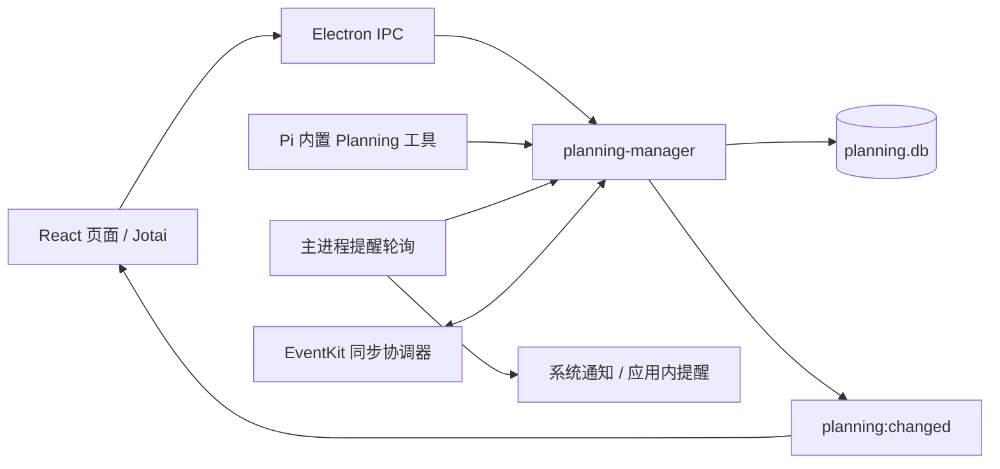

# Proma 日程、Todo 与 LiveAgent 复现分析

分析日期：2026-09-07。源码基线：Proma `3c17ff75`，LiveAgent `be86449f`。这是实现分析与建议方案，不表示功能已实现。本文将需求中的“日常”按 Proma 的“日程”理解，并同时覆盖日常定时自动执行。

## 结论

建议在 LiveAgent 新增独立的 **Planning（待办与日程）领域**，复用现有的 Rust 持久化模式、共享 React UI、项目与会话运行时、Cron 调度及 Gateway 通道。复现的核心是“记录任务 → 安排时间 → 提醒 → 交给 Agent → 查看结果与完成状态”的闭环。

必须区分四种对象：

| 对象 | 负责什么 | 示例 |
|---|---|---|
| Todo | 用户长期待办，跨会话保存 | 本周修好登录问题 |
| CalendarEvent | 时间段、全天事项及可选 Todo 关联 | 周三 14:00–15:00 排查登录问题 |
| Automation / Cron | 到时间自动执行一个任务 | 每个工作日 09:00 检查项目状态 |
| LiveAgent TaskList | 某次 Agent run 的执行步骤 | 读代码 → 修改 → 验证 |

Todo 到期不代表自动执行；收到提醒不代表任务已完成；Agent run 成功也不应直接等同于 Todo 完成。

## 1. Proma 的实际实现

### 1.1 数据与进程边界



Planning 实际使用 `node:sqlite` 和独立的 `planning.db`，生产默认位于 `~/.proma/`，开发目录通常为 `~/.proma-dev/`。开启 WAL、外键，写入使用事务，当前 schema version 为 9。虽然仓库工程约定一般偏好 JSON，分析本模块应以这份实现为准。

主要表为 `todos`、`calendar_events`、Todo/Calendar 各自的分组表、`tags` 与标签关联表、`planning_reminders`、`todo_session_links`；后续迁移增加系统同步 profile、binding、outbox、cleanup 和 conflict 表。

Automation 单独存放在 `automations.json`，使用原子文件写入；没有把定时执行混入日程表。

源码：[Planning 类型](/Users/yovinchen/Projects/Rust/Proma/packages/shared/src/types/planning.ts)、[SQLite 数据层](/Users/yovinchen/Projects/Rust/Proma/apps/electron/src/main/lib/planning-manager.ts:132)、[数据库路径](/Users/yovinchen/Projects/Rust/Proma/apps/electron/src/main/lib/config-paths.ts:861)、[Automation 持久化](/Users/yovinchen/Projects/Rust/Proma/apps/electron/src/main/lib/automation-manager.ts)。

### 1.2 Todo

字段包括标题、说明、`open/completed`、低中高优先级、截止时间、分组、标签、提醒、项目、创建/更新时间和完成时间。`sessionLinks` 记录成功创建或更新 Todo 的 Agent 会话，不存对话正文。

页面提供全部、今天、近期、已完成和分组筛选；“今天”包括所有截止时间不晚于今天结束的未完成任务，因此也包含逾期任务。支持详情编辑、说明自动保存、标记完成/恢复、项目选择、打开关联会话。

截止时间的默认值有入口差异：UI 快速创建和 Agent 创建工具默认当天结束，底层 `createTodo` 本身允许没有截止时间。Agent 工具描述要求先查询去重和复用分组，但这不是数据库唯一约束。

创建时未显式传入 reminders 且存在 dueAt，会生成默认截止提醒；改期同步自动提醒，保留手动提醒和主动推迟的提醒。完成 Todo 会完成其 pending 提醒；删除 Todo 会清理提醒，关联日程通过 `ON DELETE SET NULL` 保留。

详情编辑可携带 `expectedUpdatedAt`，数据库以条件更新拒绝旧版本；更新后的时间戳至少为旧值加一。但 Agent 的 `update_todo` 工具未传该字段，因此不能认定所有修改入口都有完整的乐观并发保护。

源码：[Todo 筛选](/Users/yovinchen/Projects/Rust/Proma/apps/electron/src/renderer/lib/todo-view.ts)、[Todo 页面](/Users/yovinchen/Projects/Rust/Proma/apps/electron/src/renderer/components/planning/PlanningView.tsx)、[默认提醒同步](/Users/yovinchen/Projects/Rust/Proma/apps/electron/src/main/lib/planning-manager.ts:564)、[Todo 更新](/Users/yovinchen/Projects/Rust/Proma/apps/electron/src/main/lib/planning-manager.ts:1198)、[Agent 工具](/Users/yovinchen/Projects/Rust/Proma/apps/electron/src/main/lib/adapters/pi-builtin-tools.ts:500)。

### 1.3 日程

`CalendarEvent` 单独存储标题、说明、开始/结束时间、全天标记、分组、标签、提醒、项目及可选 `todoId`。Todo 的截止时间与日程占用的时间段保持独立。

日历为自定义 React 月/周视图；周视图支持指针交互创建时间段，按 15 分钟吸附。显示时合并三个来源：日程时间段、未完成 Todo 的截止标记、启用 Automation 在可见日期中的预计触发。Automation 标记是计算出的展示数据，不会为每次触发插入日程。

日程创建仅在显式传入 reminders 时创建提醒，不具有 Todo 那样的默认截止提醒。现有 CalendarEvent 类型没有重复规则；系统同步也跳过 recurring 项，因此这不是完整的重复日历事件实现。

源码：[CalendarWorkspace](/Users/yovinchen/Projects/Rust/Proma/apps/electron/src/renderer/components/planning/CalendarWorkspace.tsx)、[日程 CRUD](/Users/yovinchen/Projects/Rust/Proma/apps/electron/src/main/lib/planning-manager.ts:1243)、[Automation 展开计算](/Users/yovinchen/Projects/Rust/Proma/packages/shared/src/utils/automation-schedule.ts)、[系统重复项处理](/Users/yovinchen/Projects/Rust/Proma/apps/electron/src/main/lib/planning-manager.ts:991)。

### 1.4 提醒

提醒是独立记录，含 `targetType/targetId`、`triggerAt`、`snoozedUntil`、`pending/acknowledged/completed`、`origin` 和 `lastNotifiedAt`。

主进程启动时立即扫描，此后每 30 秒扫描一次。有效到期时间为 `snoozedUntil ?? triggerAt`，只领取 pending 且未通知的到期记录；确认将其置为 acknowledged，推迟会清空已通知标记，到下一次到期可再次通知。未确认的到期记录可从数据库恢复成常驻提醒条。

系统通知由 Electron 主进程发出，窗口隐藏时也能工作；进程退出后本地轮询停止。已成功同步到受管系统提醒事项的默认截止提醒会抑制应用的重复系统弹窗。领取记录在发送系统通知前已标记，因此不能把此实现描述为严格“恰好送达一次”。

源码：[提醒调度器](/Users/yovinchen/Projects/Rust/Proma/apps/electron/src/main/lib/planning-reminder-scheduler.ts)、[提醒领取与状态](/Users/yovinchen/Projects/Rust/Proma/apps/electron/src/main/lib/planning-manager.ts:1333)、[常驻提醒条](/Users/yovinchen/Projects/Rust/Proma/apps/electron/src/renderer/components/planning/PlanningReminderRail.tsx)。

### 1.5 Todo 与 Agent 的闭环

“开始运行 Agent”的具体链路：

1. 用户选执行项目，UI 发送 Todo ID、项目、模型和 expectedUpdatedAt。
2. 主进程检查项目存在及 Todo 版本，必要时更新项目归属，再创建 Agent 会话。
3. UI 打开该会话，传递带 Todo ID 的待发送 prompt 和 `mentionedTodoIds`。
4. Agent 通过 `get_todo` 读取数据库中的最新详情，再推进实际工作。
5. Agent 成功创建、修改或完成 Todo 时记录会话关联并广播变更，页面刷新。

工具以 `mcp__planning__*` 命名，但当前实现是 Pi runtime 中注册的内置工具，直接调用同一个 manager；复现不需要部署独立 MCP 服务。工具覆盖 Todo、日程、分组、标签和提醒。

显式引用通过 `referenced_planning` 注入最新记录，做转义、数量和长度限制，并明确内容属于数据。完成 Todo 依赖工具调用及任务完成条件，没有简单绑定到 Agent 的终态事件。

主进程把项目更新和会话创建放在同一次同步处理内，能防止 JS 异步交错；它不是跨 Planning SQLite 和会话文件的统一事务。LiveAgent 可以进一步补上幂等启动与中断恢复。

源码：[启动 IPC](/Users/yovinchen/Projects/Rust/Proma/apps/electron/src/main/ipc.ts:5631)、[UI 启动链路](/Users/yovinchen/Projects/Rust/Proma/apps/electron/src/renderer/components/planning/PlanningView.tsx:617)、[启动 prompt](/Users/yovinchen/Projects/Rust/Proma/apps/electron/src/renderer/lib/todo-agent-prompt.ts)、[引用上下文](/Users/yovinchen/Projects/Rust/Proma/apps/electron/src/main/lib/planning-reference-context.ts)。

### 1.6 日常自动执行与系统同步

Automation 支持 interval、daily、weekly、monthly、once，附加工作日、有效时段和运行次数限制。调度器每 30 秒检查 nextRunAt，避免同一任务重入，连续失败达到阈值后暂停，重启对过期时间作顺延处理。

当前默认会话策略是 daily：同日复用、跨日新建，同日上下文使用率达到 70% 时也新建；reuse 模式长期复用。部分类型注释仍写“每次新建”，应以 scheduler 实现为准。

EventKit 同步由服务、原生桥接和 outbox 协调器构成；当前代码要求 macOS 14+。支持受管集合以及用户明确连接的已有系统集合，带权限/只读能力、重试和冲突选择。同步到系统集合不等于应用自己实现了 iCloud 服务端同步。此部分适合独立后续阶段。

源码：[Automation 调度](/Users/yovinchen/Projects/Rust/Proma/apps/electron/src/main/lib/automation-scheduler.ts)、[系统同步服务](/Users/yovinchen/Projects/Rust/Proma/apps/electron/src/main/lib/planning-native-sync-service.ts)、[同步协调器](/Users/yovinchen/Projects/Rust/Proma/apps/electron/src/main/lib/planning-native-sync-coordinator.ts)。

## 2. LiveAgent 已有能力与差距

| 能力 | 已有实现 | 复现需要增加 |
|---|---|---|
| Agent 执行步骤 | TaskCreate/TaskUpdate/TaskList，runId + revision，随 conversation.meta.taskList 持久化 | 独立长期 Todo 模型，不能用 run 级数字 ID 充当长期待办 ID |
| 定时执行 | Rust AutomationStore + tokio-cron-scheduler；bash/http/prompt；本地时区六字段 Cron | 日历预计触发投影、自然语言友好的频率表单；若要求 once，补绝对时间调度语义 |
| Cron 执行恢复 | pending → leased → done/expired，原子领取、超时和重启恢复 | 复用领取模式实现提醒；两类状态和业务保持分开 |
| Cron Agent | React CronPromptRunner 运行工具，保存结论 | 可打开的完整对话、Todo 关联和日内复用策略 |
| 桌面/Web 共用 UI | agent-ui 共享组件与 external store；平台 backend 适配 | Planning 页面、共享类型/store、双端适配 |
| 数据同步 | 桌面权威状态，Gateway 转发 Cron 管理和快照 | Planning 专属请求、变更事件、断线重同步 |
| 项目与会话 | 已有项目、历史、Workbench、会话引用 | Todo→会话启动与关联，Planning 引用类型 |
| 提醒与日历 | 本次在相关源码中未发现对应长期实体及持久提醒服务 | Rust 提醒服务、应用内通知入口，系统通知适配 |

LiveAgent 的 TaskList 已经持久化，不能误称“只在内存”。它的作用域是一次 run，缺少长期待办所需的截止时间、日程、分组、提醒和跨会话索引。

当前 CronPromptRunner 构建一次性 Context 调用 Agent runner，将结论交给 AutomationStore；代码中的 `cron-prompt-${executionId}` 是 debug logger 的标识，不能据此认定已经创建了用户可打开的完整历史会话。Prompt 执行依赖桌面 WebView 中的 runner，Rust 调度器存在并不代表应用退出后仍能执行。

源码：[Task 工具](/Users/yovinchen/Projects/Rust/LiveAgent/crates/agent-gui/src/lib/tools/taskTools.ts)、[Task 持久化](/Users/yovinchen/Projects/Rust/LiveAgent/crates/agent-gui/src/pages/chat/runtime/useSendChatTurn.ts:1654)、[Automation 类型](/Users/yovinchen/Projects/Rust/LiveAgent/crates/agent-ui/src/lib/automation/types.ts)、[Rust 调度](/Users/yovinchen/Projects/Rust/LiveAgent/crates/agent-gui/src-tauri/src/services/automation/scheduler.rs)、[CronPromptRunner](/Users/yovinchen/Projects/Rust/LiveAgent/crates/agent-gui/src/components/cron/CronPromptRunner.tsx:140)、[共享 store](/Users/yovinchen/Projects/Rust/LiveAgent/crates/agent-ui/src/lib/automation/store.ts)、[Web backend](/Users/yovinchen/Projects/Rust/LiveAgent/crates/agent-gateway/web/src/lib/automation/backend.ts)。

## 3. 建议的 LiveAgent 实现

### 3.1 模块落点

以下为建议新增目录，不是已存在实现：

```text
crates/agent-ui/src/lib/planning/           types、store、selectors、backend 契约
crates/agent-ui/src/pages/planning/         Todo、月/周日历、详情、提醒列表
crates/agent-gui/src/lib/planning/          Tauri backend、会话启动协调
crates/agent-gui/src/lib/tools/planningTools.ts
crates/agent-gui/src-tauri/src/services/planning/
  mod.rs / types.rs / db.rs / store.rs / reminders.rs
crates/agent-gui/src-tauri/src/commands/planning/
crates/agent-gateway/web/src/lib/planning/  Gateway backend
```

第一版建议继续使用现有 `config.sqlite`，新增带 `planning_` 前缀的表和独立 migration 元数据；复用 rusqlite、WAL、事务、锁及通知模式。备份/导入必须明确包含新增数据，不能假设增加表后现有设置导出就自动覆盖。数据量或独立导出需求增长后再评估拆库。

前端沿用 LiveAgent 的共享 external store，不为移植 Proma 单独引入 Jotai。组件放在 agent-ui，调用平台 backend；桌面经 Tauri、Web 经 Gateway，最终进入同一个 Rust store。Web 不维护第二套可写数据库。

### 3.2 数据及一致性

| 实体 | 建议核心字段 |
|---|---|
| Todo | id、title、notes、status、priority、dueAt、projectId、groupId、revision、createdAt、updatedAt、completedAt |
| CalendarEvent | id、title、notes、startAt、endAt、allDay、timeZone、todoId、projectId、groupId、revision |
| Reminder | id、targetType、targetId、triggerAt、snoozedUntil、status、origin、revision、通知领取/送达状态 |
| TodoConversationLink | todoId、conversationId、runId（可选）、关联角色、首次/最近关联时间 |
| Group / Tag | 独立 ID、名称、颜色；分组限定 todo/calendar scope |
| PlanningStartRequest | requestId、todoId、conversationId、执行项目、状态、错误，供幂等启动与恢复 |

采用 UUID 和独立整数 revision，前端与 Agent 修改均传 `expectedRevision`。同字段冲突保留用户草稿并返回最新记录；不要照搬 Automation store 的无条件自动重试，因为长说明文本发生冲突后自动重放可能覆盖他人的编辑。

Todo 归属与执行项目可以为空，但点击运行必须解析为已有且可访问的项目，交给现有项目服务校验；不能把模型传来的任意路径直接当作执行目录。删除项目或会话时保留待办与“关联不可用”的展示。

日期层面建议显式区分“仅日期”和“具体时刻”，全天事项使用本地日期边界，定时事项保存时间戳与时区。第一版就覆盖跨日、夏令时和不同浏览器时区；时间轴采用一致的区间边界，避免相邻事件重复显示。

### 3.3 API、工具与同步

建议 Rust command / Gateway RPC 提供：

- Todo、Event 的 list/get/create/update/delete；Todo complete/reopen。
- Group/Tag 管理及按项目、状态、时间范围查询。
- Reminder listActive/create/update/acknowledge/snooze/delete。
- `start_todo_agent(todoId, projectId, expectedRevision, requestId, model)`。
- 带 revision、资源范围及变更 ID 的 `planning:changed`；新连接或事件序号缺口时重新拉取快照。

Gateway 参照已有 `CronManageRequest/Response` 链路增加 Planning 协议，覆盖 proto、生成代码、Go 路由、Rust envelope handler、浏览器 socket。请求按目标桌面 Agent 路由与认证，桌面离线时明确反馈不可执行。增量变化带 revision，避免迟到的列表响应覆盖新状态。

Agent 内置工具建议以 TodoList/TodoGet/TodoCreate/TodoUpdate/TodoComplete、CalendarList/CalendarGet/CalendarCreate/CalendarUpdate、ReminderSnooze 等独立命名，避免与现有 TaskList 混淆。注册在 builtinRegistry，补工具目录、只读元数据、策略判断及运行作用域；所有入口共享 Rust 校验。

Plan 模式只注入或允许只读 Planning 工具。后台 Cron 的工具能力依据现有 runtime scope 明确配置，尤其是删除和外部系统同步。Planning 引用只携带稳定 ID，发送时再读取完整最新记录并作为数据注入；不能把 Todo 说明提升成系统指令。

### 3.4 “交给 Agent”与提醒闭环

启动链路建议为：原子校验 Todo revision → 记录幂等启动请求与执行项目 → 通过现有会话运行时创建/取得 conversation → 保存关联 → 投递带 Todo ID 的消息。启动失败记录可恢复状态；同一 requestId 重试不得生成第二个会话。跨存储边界通过状态协调与补偿完成，不用一把数据库锁覆盖整个模型运行。

新会话先读取 Todo，再使用现有 TaskList 拆执行步骤；完成后显式调用 TodoComplete。UI 同时展示长期 Todo 状态与关联会话的 running/failed/completed 等执行信息，两者不互相冒充。

提醒由 Rust 启动扫描和短周期计时器负责；在事务内领取到期记录，避免多窗口/Web 重复发送。应用内提醒以数据库为准；系统通知由单一桌面服务发出。确认和推迟通过后端写入并广播所有客户端。通知发送失败、进程在领取后退出应有重试/租约策略，但系统通知通常无法承诺严格恰好一次。

### 3.5 UI 接入

先增加一个共享“计划”入口，提供待办、日程、自动化三个页签；自动化复用已有 Cron 页面能力。Todo 使用筛选列表加详情面板，日程用月/周视图，顶部展示可处理的提醒入口。

日历只在可见日期范围查询事件与计算 Cron 预计触发，分别用类型标记区分；点击 Cron 进入任务详情，不把预计触发编辑成普通日程。预计时间应由与 Rust 调度一致的解析逻辑提供，避免两端 cron/时区语义不同。

第一版先作为独立页面接入。之后若需要与聊天拼接，再扩展 Workbench surface 类型、身份、序列化/迁移、路由和桌面/Web host；当前 Workbench 仅靠增加一个页面组件还不能承载新的 planning surface。

## 4. 实施顺序与验收

| 阶段 | 交付内容 | 完成标准 |
|---|---|---|
| P0：长期待办闭环 | Rust 数据层、Todo UI、分组/标签基础、Agent CRUD、关联会话和项目 | 手动/聊天创建 → 重启可见 → 选项目运行 → 查看会话 → 显式完成；冲突不覆盖 |
| P1：日程和提醒 | Event 数据、月/周视图、Todo 截止标记、提醒确认/推迟、桌面系统通知适配 | 建时间段、跨日显示、到期提醒、推迟重触发、窗口隐藏仍提醒、重启恢复 |
| P2：跨端和自动化联动 | Gateway 协议/Web 页面、断线重同步、Cron 投影、执行历史会话化 | Web 修改同步桌面，多客户端无重复通知，Cron 结果能打开执行会话 |
| P3：系统生态与高级交互 | EventKit 同步、outbox/冲突恢复、Workbench 拼接，按需增加重复事件 | 权限撤销/只读目标正确处理，外部修改不覆盖，循环事件语义完整再开放 |

P0 即预留双端 backend 契约，P2 补齐传输和浏览器验收。若要求首版与 Proma 核心体验相当，交付范围至少包含 P0 + P1；仅增加 Todo 页面不足以复现完整闭环。

关键验证场景：

1. Todo 修改、标签替换、提醒更新在异常时整体回滚；旧 revision 更新失败且保留草稿。
2. 改截止时间只移动自动提醒；手动提醒、已推迟提醒保留；完成 Todo 后不再弹 pending 提醒。
3. Proma 原行为为删除 Todo 后保留关联日程；LiveAgent 按当前回收站设计保留关联关系并隐藏，永久删除时清理排期。删除会话不删除长期待办。
4. 两窗口同时领取提醒、确认和推迟，结果以数据库版本为准；启动扫描和系统唤醒不会连续刷屏。
5. Agent 启动重试不重复创建会话；项目切换、项目失效、会话创建/消息投递失败均有可恢复结果。
6. 日历覆盖跨午夜、多天全天、无 endAt、时区和夏令时；Cron 预计触发与实际调度一致。
7. Web 断线重连、事件乱序、桌面离线以及目标 Agent 切换不会显示或改写另一 Agent 的数据。
8. 升级、备份和恢复保留所有 Planning 关联；提醒发送中崩溃不会永久丢失应用内待处理记录。

## 5. 本次分析范围

已沿类型、持久化、IPC、前端状态、提醒、Agent 工具、Cron 及系统同步路径核对源码，并阅读 Proma 现有 Planning 测试。未启动两款应用、未运行其测试、未验证真实系统通知或 EventKit 授权；以上运行行为为源码分析结论，待实现阶段执行相应验收。

本次仅新增此分析文档，未修改功能代码。分析期间 LiveAgent 中存在其他并行改动，均保留；Proma 仓库未写入。
